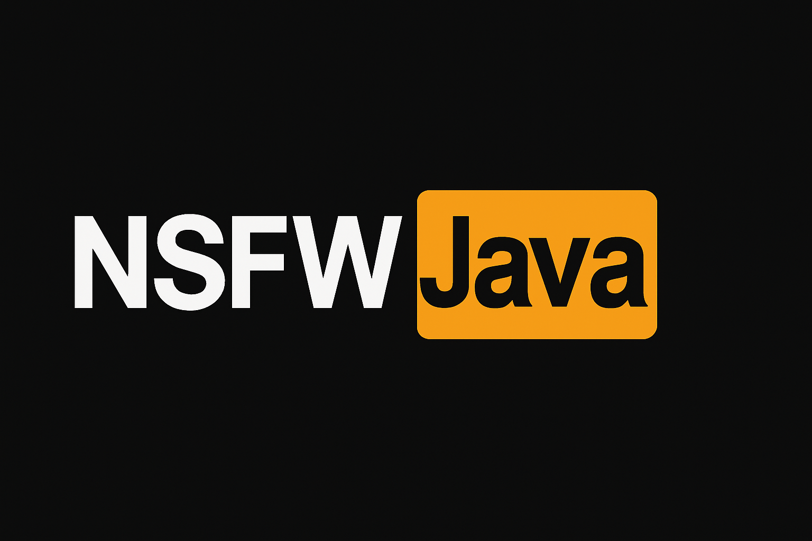

# 🖼️ NSFW Java - NSFW 图像分类（基于 TensorFlow Java）

## 📌 项目简介 | Project Description

**NSFW Java** 是一个使用 **TensorFlow Java API (2.x)** 实现的纯Java图像内容审核工具，支持识别以下 5 类 NSFW 内容：

- Drawing（漫画/绘画）
- Hentai（二次元色情）
- Neutral（正常内容）
- Porn（色情）
- Sexy（性感）

适用于图片智能审核场景，可作为人工智能内容风控系统的模型调用模块。
内置Mobilenet模型并非完美，但准确率可达约 93%。
---

**NSFW Java** is an NSFW (Not Safe For Work) image classification project built with **TensorFlow Java API (2.x)**. It supports detection of the following 5 classes:

- Drawing
- Hentai
- Neutral
- Porn
- Sexy

This tool is ideal for automated image moderation and can be integrated into AI-based content filtering pipelines.
It is NOT perfect, but it's pretty accurate (~93% with midsized model)

---

## 🚀 功能特性 

✅ 支持 TensorFlow .pb 文件加载

✅ 支持图像缩放、归一化、张量构造

✅ 支持 TensorFlow Java API 推理与输出解析

✅ 可轻松集成至内容审核系统

## 🚀 Features
✅ Load TensorFlow .pb models directly

✅ Image preprocessing: resize & normalize

✅ Use TensorFlow Java API for inference

✅ Ready to integrate into content moderation pipelines

---

## 🧩 项目依赖 | Dependencies

| 名称 | 说明                                                   |
|------|------------------------------------------------------|
| Java | 11 或更高版本                                             |
| TensorFlow Java | 推荐使用 `org.tensorflow:tensorflow-core-platform:1.0.0` |
| 图像处理 | Java 标准库 `javax.imageio`、`BufferedImage`             |

---
## 调用方式 | API Usage

```java
Map<String, Float> result = ImageCensor.predict("image.jpg");
```
 关闭资源 | Shutdown  完成预测后，调用：

```java
ModelHolder.close();
```


## 💡 模型说明 | Model Info

> 本项目使用的模型结构基于 [Mobilenet](https://github.com/GantMan/nsfw_model/tree/master)，输入尺寸为 244x244

---


